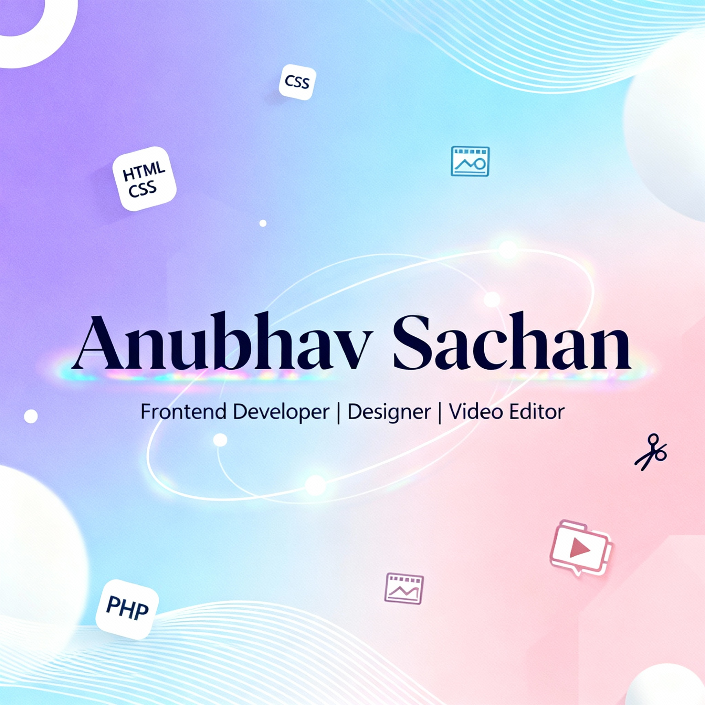

<!-- Dynamic GitHub Banner -->

  <picture>
    <!-- Dark mode image -->
    <source media="(prefers-color-scheme: dark)" srcset="banner-dark.png">
    <!-- Light mode image -->
    <source media="(prefers-color-scheme: light)" srcset="banner-light.png">
    <!-- Fallback image (if browser doesn’t support theme switching) -->
    
  </picture>

<h1 align="center">👋 Hi, I'm Anubhav Sachan</h1>

  <b>Frontend Developer | Designer | Video Editor</b> 
  🌐 <a href="https://www.linkedin.com/in/anubhav-sachan-b5611619b" target="_blank">LinkedIn</a> • 
  💻 <a href="https://github.com/Anubhav-143" target="_blank">GitHub</a>

---

### 🧠 About Me

🎨 Passionate about crafting **beautiful, functional, and responsive web experiences**.  
💡 I love blending **design + technology** to create visually appealing and interactive projects.  
📽️ Skilled in **CapCut**, **Adobe Premiere Pro**, and **Filmora** for creative editing.  

---

### ⚙️ Tech Stack

  

---

### ✨ Fun Fact

> “I love designing futuristic UIs that feel alive with light and motion.”

---

  

